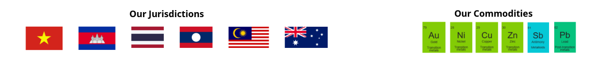
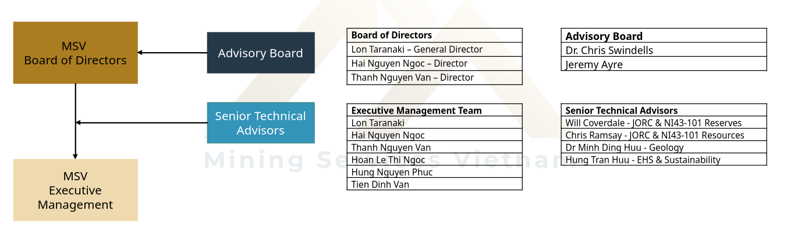

Extract manually by me from References/20260201_MSV_COR_CompanyProfile-Interim.pptx

# Company Overview
Mining Services Vietnam (MSV) is a Vietnam-based mining services company delivering practical, high-quality solutions to uncover potential and drive progress for our clients across Southeast Asia.
Leveraging our strong local presence, regional experience, and international technical capability, MSV provides cost-effective, practical mining solutions that meet Western technical and safety standards, while remaining aligned with local cost structures and operating conditions.

Our vision is simple: 	to deliver high-standard, cost-effective mining services while protecting the environment and ensuring the safety and wellbeing of people and communities. 

MSV offers an integrated suite of mining services, including:
Exploration and geological services, from grassroots exploration through geophysics and drilling, including full program design, execution, and reporting
Engineering, Procurement and Construction Management (EPCM) services across the project lifecycle
Resource and reserve development, compliant with local reporting requirements as well as JORC and NI43-101 standards
Engineering services, including mining, civil, and mechanical disciplines
Human resources and administrative management, supporting both project and operational teams
Operational readiness & operations support, helping establish personnel, operating procedures and systems	

Our Jurisdictions (some flag icons of Vietnam, Cambodia, Thailand, Laos, Malaysia, Australia)
Our Commodities (some icons of gold, nickel, copper, zinc, antimony, lead)
See more at 

# Leadership & Key Personnel

MSV has established a strong local technical and management team, supported by experienced and highly respected mining professionals. The company is guided by an Advisory Board of accomplished industry leaders, providing strategic oversight and independent advice.

In support of the executive management team, MSV has also engaged a group of Senior Technical Advisors who provide JORC and NI 43-101 sign-off capability, along with specialist expertise across environmental, health, safety and sustainability (EHS&S) and geological disciplines, ensuring robust governance, technical assurance, and compliance with international standards.
: Chart and boards 

Then there is a list of bio just like in extracted content from docs.

# Core Competencies
MSV delivers integrated mining services across the full project lifecycle, from early-stage exploration through project development and into operations. Our capability is built on hands-on regional experience, enabling the delivery of technically robust, cost-effective, and operationally practical solutions aligned with project objectives and local operating conditions.
MSV’s core competencies include:

Exploration & Geological Services
Resource & Reserve Development
Project Delivery (Owner’s Team & EPCM)
Operational Readiness & Support

## Exploration & Geological Services

MSV provides an end-to-end exploration capability, combining program design, execution, and technical reporting using in-house teams, equipment, and specialist support delivering improved data quality, schedule control, and cost efficiency.
 
Key services include:
Grassroots exploration, including geological mapping, soil and rock-chip sampling, trenching, and technical reporting
Geophysical surveys, (EM, IP, and DHEM) including design, execution, interpretation and reporting
Drilling services, from target generation to execution, with over 150,000 metres of diamond drilling delivered
In-house logging, sampling, laboratory management, and data preparation to support geological modelling and reporting
Geological database management and technical reporting
 
## Resource & Reserve Development
 
MSV develops geological, resource, and reserve models using industry-standard software including Surpac and Micromine, compliant with local, JORC, and NI 43-101 reporting requirements.
 
Reserve development includes mine optimisation and reserve conversion studies, supported by an extensive internal cost database, with certification provided by MSV’s Competent Persons where required.

## Project Delivery

MSV operates as Owner’s Representative or EPCM contractor, managing engineering, procurement, construction, and commissioning to achieve scope, cost, schedule, quality, safety, and performance objectives.

## Operational Readiness & Support

MSV supports the transition from development to steady-state operations, establishing robust, compliant operating organisations, including HR, procurement, finance, governance, HSE, and reporting systems.

# Service Delivery Model
MSV offers a flexible service delivery model aligned to project stage, risk profile, and client objectives, engaging as an advisor, EPCM contractor, or embedded team.

## Engagement Options

Advisory – technical and commercial advice, reviews, studies, and owner’s team support
EPCM – integrated delivery of engineering, procurement, construction management, and commissioning
Embedded Teams – MSV personnel embedded within client teams for targeted capability and continuity

## Phase-Based Support

Exploration – program design, execution, and reporting
Studies & Development – resource, reserve, mine planning, project definition
Execution – EPCM delivery and owner’s team representation
Operations – operational readiness, ramp-up, and optimisation

## Commercial Structures
 
Fee-for-Service - MSV’s primary engagement model
Equity Participation - selectively considered for the right projects where long-term alignment and material value contribution exist

-> **Across all engagement models, MSV delivers practical, cost-effective solutions to international standards, aligned with local operating conditions and project objectives.**

# Our projects

## Project 1 - Cambodia

**Client:** Sambo Cambodia  
**Country:** Cambodia  
**Commodity:** Gold  
**Status:** Aug 2025 – ongoing  

**Description:**  
Providing the client with a full suite of services to take their project from exploration through to production.

**Services:**  
- Exploration & Geological Services  
- Resource & Reserve Development  
- Project Delivery (Owner’s Team & EPCM)  
- Operational Readiness & Support  

**Delivery Model:**  
- Advisory  
- EPCM  

---

## Project 2 - Laos

**Client:** Cavico Laos  
**Country:** Laos  
**Commodity:** Gold  
**Status:** Aug 2024 – Aug 2025  

**Description:**  
Providing the client with grass roots exploration services (mapping, soils, rock chips and trenching) and drill target generation for gold.

**Services:**  
- Exploration & Geological Services  

**Delivery Model:**  
- Advisory  

---

## Project 3 - Vietnam

**Client:** Xuan Loc Tho – Ta Khoa Project Joint Venture  
**Country:** Vietnam  
**Commodity:** Nickel  
**Status:** Aug 2025 – ongoing  

**Description:**  
MSV has 3 engineers embedded in the client's team to help advance permitting, licensing and project studies (including feasibility study & EIA).

**Services:**  
- Project Delivery (Owner’s Team & EPCM)  

**Delivery Model:**  
- Embedded Teams  

# Contact Us
Company Email	 info@dma-msv.com
 
Phone  		+84 24 62500426
 
Contact Persons 
Lon Taranaki		Lon@dma-msv.com
Thanh Nguyen Van	Thanh.nguyen@dma-msv.com
Hai Nguyen Ngoc	Hai.nguyen@dma-msv.com
Hoan Le Thi Ngoc 	Hoan.le@dma-msv.com
Hung Nguyen Phuc	Hung.nguyen@dma-msv.com
Tien Dinh Van	Tien.dinh@dma-msv.com
 
Address
CÔNG TY CỔ PHẦN DỊCH VỤ MỎ VIỆT NAM MINING SERVICES VIETNAM JSC
Văn phòng 5A, tầng 23, tháp A, tòa nhà văn phòng Hudtower, 37 Lê Văn Lương, P. Thanh Xuân, TP. Hà Nội
MST: 0111214046
 
Website 		www.dma-msv.com